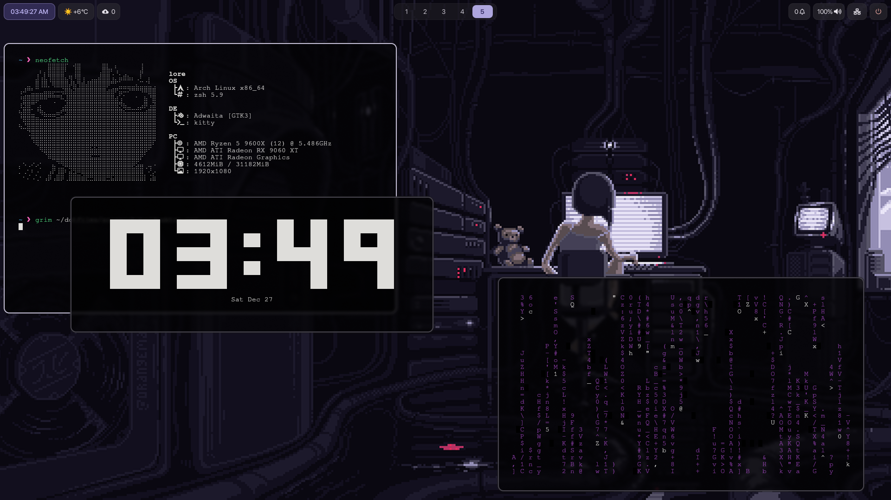

# Arch Linux + Hyprland Dotfiles

My personal configuration files for Arch Linux with Hyprland.

---

## 📸 Screenshots

> Add your screenshots here!



---

## 🖥️ Setup

- **OS:** Arch Linux
- **WM:** Hyprland
- **Shell:** Zsh
- **Terminal:** Kitty
- **Bar:** Waybar
- **Launcher:** Rofi
- **Notifications:** SwayNC
- **Lock Screen:** Hyprlock
- **Wallpaper:** SWWW
- **Color Scheme:** Matugen

---

## ✨ Features

- 🎨 Dynamic theming with Matugen
- 🖼️ Beautiful wallpapers with SWWW transitions
- 🔔 Modern notifications with SwayNC
- 🎵 Audio visualizer with Cava
- 🔒 Secure lock screen with Hyprlock
- ⚡ Optimized performance and smooth animations

---

## 🚀 Installation

### Quick Install
```bash
# Clone the repository
git clone https://github.com/Lore1677/dotfiles.git
cd dotfiles

# Run the installation script
chmod +x install.sh
./install.sh
```

The script will automatically:
- Backup your existing configs
- Install all dotfiles via symlinks
- Make scripts executable
- Optionally install required packages
- Set Zsh as default shell
- Reload Hyprland config

---

## 📦 Dependencies

The installation script can install everything automatically. If you prefer manual installation:

### Core Packages
```bash
sudo pacman -S hyprland waybar rofi kitty cava swaync hyprlock hypridle \
zsh git swww htop neovim nano curl swayimg pavucontrol networkmanager \
flatpak grim slurp yazi tree zip unzip ark btop pipewire pipewire-pulse \
wireplumber sddm
```

### AUR Packages
```bash
yay -S hyprpicker-git hyprshot apple-fonts ttf-jetbrains-mono-nerd \
neofetch peaclock cmatrix cbonsai wlogout matugen
```

---

## 🎨 Customization

### Wallpapers
Place your wallpapers in `~/Pictures/wallpapers/` and use SWWW to change them:
```bash
swww img ~/Pictures/wallpapers/your-wallpaper.jpg
```

### Colors
Generate a new colorscheme from your wallpaper with Matugen:
```bash
matugen image ~/Pictures/wallpapers/your-wallpaper.jpg
```

### Configuration Files
All configs are in `~/.config/` and can be edited to your preference:
- Hyprland: `~/.config/hypr/`
- Waybar: `~/.config/waybar/`
- Rofi: `~/.config/rofi/`
- Kitty: `~/.config/kitty/`

---

## 🛠️ Troubleshooting

**Hyprland won't start?**
Check the logs: `cat /tmp/hypr/$(ls -t /tmp/hypr/ | head -n 1)/hyprland.log`

**Scripts not working?**
Make them executable: `find ~/.config -name "*.sh" -exec chmod +x {} \;`

**Waybar not showing?**
Restart it: `killall waybar && waybar &`

---

## 💖 Credits

Thanks to the Hyprland community for inspiration and support!

---

## 📄 License

MIT License - Feel free to use and modify!

---

<div align="center">

Made with ❤️ by [Lore1677](https://github.com/Lore1677)

</div>
